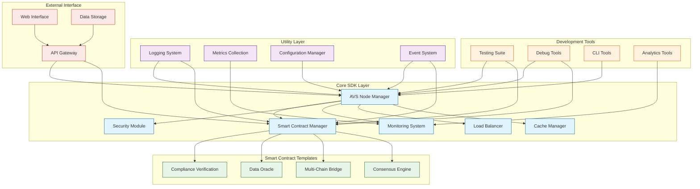

# AVS Development SDK & Template Library

[](https://github.com/Programmer-Shivansh/AVS-SDK/blob/main/LICENSE)
[](https://shivanshs-organization-2.gitbook.io/avs-sdk)

## 📚 Documentation

For detailed documentation and implementation guides, please visit our [GitBook Documentation](https://shivanshs-organization-2.gitbook.io/avs-sdk).

## 🚀 Overview

AVS-SDK (Actively Validated Services) is a comprehensive framework for building and managing decentralized services with built-in validation mechanisms. It provides a robust set of tools and utilities for developing secure, scalable, and efficient blockchain applications.

## 🏗 Technical Architecture



The AVS-SDK is built on a layered architecture that ensures modularity, scalability, and maintainability:

### Core SDK Layer
- **AVS Node Manager**: Central component managing node operations
- **Smart Contract Manager**: Handles smart contract deployment and interactions
- **Security Module**: Implements security protocols and validations
- **Monitoring System**: Real-time system monitoring and alerts
- **Load Balancer**: Distributes workload across nodes
- **Cache Manager**: Optimizes data access and storage

### Smart Contract Templates
- **Compliance Verification**: Ensures regulatory compliance
- **Data Oracle**: External data integration
- **Multi-Chain Bridge**: Cross-chain communication
- **Consensus Engine**: Custom consensus mechanisms

### Development Tools
- **Testing Suite**: Comprehensive testing tools
- **Debug Tools**: Debugging utilities
- **CLI Tools**: Command-line interface
- **Analytics Tools**: Performance and usage analytics

### Utility Layer
- **Logging System**: Advanced logging capabilities
- **Metrics Collection**: System metrics and statistics
- **Configuration Manager**: System configuration handling
- **Event System**: Event handling and propagation

### External Interface
- **API Gateway**: RESTful API interface
- **Web Interface**: User interface components
- **Data Storage**: Persistent data management

## 🛠 Installation

```bash
npm install avs-sdk
```

## 🔧 Quick Start

```javascript
const AVS = require('avs-sdk');

```

## 🔐 Security Features

- Built-in validation mechanisms
- Secure contract deployment
- Multi-signature support
- Audit logging
- Role-based access control

## 🏷 Key Features

- Modular architecture
- Cross-chain compatibility
- Real-time monitoring
- Scalable design
- Comprehensive testing tools
- Developer-friendly APIs

## 📈 Performance

- High throughput capacity
- Low latency operations
- Efficient caching mechanisms
- Optimized data structures

## 🤝 Contributing

We welcome contributions! To contribute:

1. Fork the repository
2. Create your feature branch (`git checkout -b feature/AmazingFeature`)
3. Commit your changes (`git commit -m 'Add some AmazingFeature'`)
4. Push to the branch (`git push origin feature/AmazingFeature`)
5. Open a Pull Request

Please ensure your PR adheres to our coding guidelines and includes appropriate tests.

## 📝 License

This project is licensed under the MIT License - see the [LICENSE](LICENSE) file for details.

## 📞 Contact

For support or inquiries, please contact:

- Email: shivanshchauhan2005@gmail.com
- LinkedIn: [Shivansh Chauhan](https://www.linkedin.com/in/shivansh-chauhan-07014b244/)

